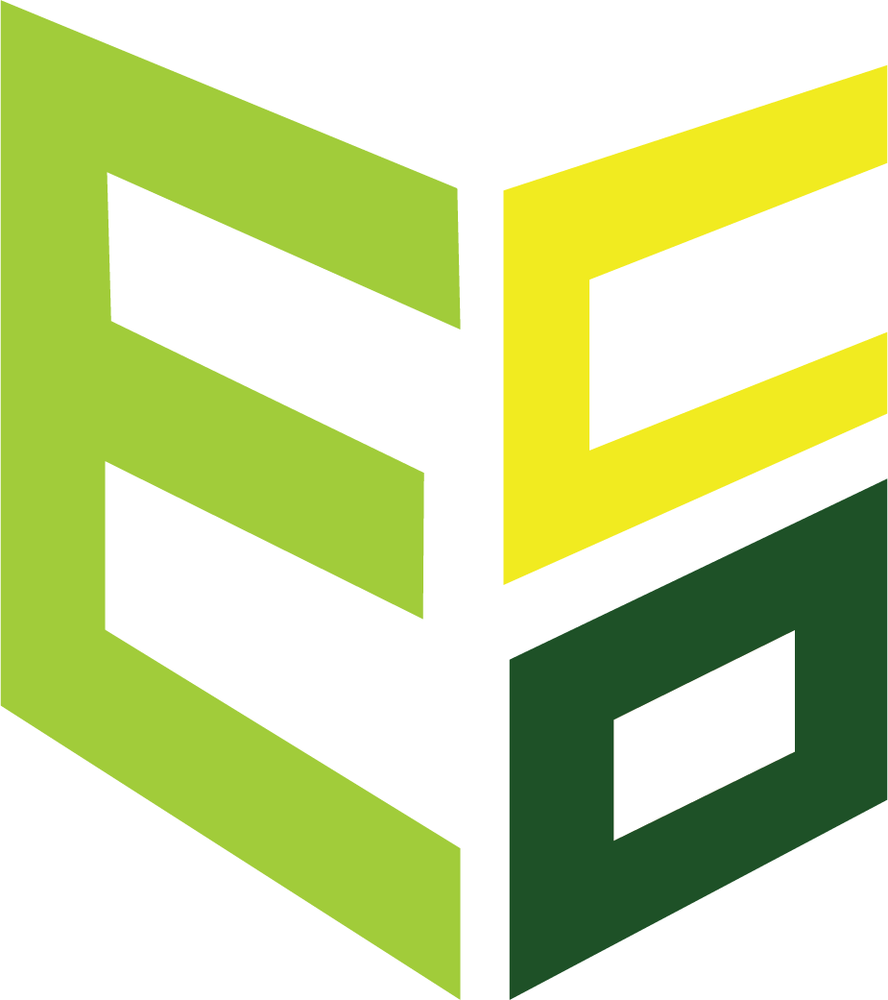

# carbon_footprint_tracker_1

<!-- PROJECT LOGO -->
<br />
<div align="center">
  <a>
    
  </a>
  <h3 align="center">Ecolibrium.app</h3>
  <p align="center">
    Track and Reduce Your Carbon Footprint Today!
    <br />
    <a href="https://ecolibrium.app/"><strong>Kickstart your Carbon Journey Today »</strong></a>
    <br />
    <br />
    <a>View Demo</a>
  </p>
</div>

<!-- TABLE OF CONTENTS -->
<details>
  <summary>Table of Contents</summary>
  <ol>
    <li>
      <a href="#about-the-project">About The Project</a>
      <ul>
        <li><a href="#built-with">Built With</a></li>
      </ul>
    </li>
    <li>
      <a href="#getting-started">Getting Started</a>
      <ul>
        <li><a href="#prerequisites">Prerequisites</a></li>
        <li><a href="#installation">Installation</a></li>
      </ul>
    </li>
    <li><a href="#features">Features</a></li>
    <li><a href="#contact">Contact</a></li>
  </ol>
</details>

<!-- ABOUT THE PROJECT -->
## About The Project

Even though Carbon Emissions have been placed under the microscope in recent years, there is still a dearth of accessible tools with personalised guidance for individuals to track and reduce their Carbon Footprint. With Carbon Consciousness only becoming more in vogue as time passes, we want to help you consolidate your efforts in fighting climate change. Ecolibrium provides the perfect service to analyze and help you achieve your sustainability goals.

Here's why:
* We quantify each action in your month in terms of emissions and give you the hard numbers of your progress.
* Based on your responses, we provide personalized suggestions to improve your carbon footprint.
* We provide a one-stop interface for many sustainability-related needs.

This project aims to contribute to the United Nations Sustainable Development Goals:

* **SDG 12**: Ensuring `sustainable consumption and production` patterns, which is key to sustaining the livelihoods of current and future generations.
* **SDG 13**: To take urgent `climate action` to combat global warming and its impacts.

### Built With
We have used the following technologies to build this app:
* **React**: ReactJS is a JavaScript library for building user interfaces, providing a declarative and efficient way to create dynamic and interactive front-end applications.
* **Firebase**: Google Firebase is a comprehensive mobile and web application development platform that offers real-time database management and authorization.
* **OneSignal**: OneSignal is a push notification service that enables us to send messages and updates to users across various platforms, helping us engage and retain app users effectively.
* **Google Cloud Run**: Google Cloud Run is a serverless platform offering scalability, flexibility, and ease of deployment, ensuring optimal performance and resource utilization.

<p align="right">(<a href="#table-of-contents">back to top</a>)</p>

<!-- GETTING STARTED -->
## Getting Started

To get a local copy up and running, follow these simple example steps.

### Prerequisites
If you do not have node.js in your system, refer to the [documentation](https://nodejs.org/en/) for steps to install.

### Installation
1. Please contact us at ecofootprinttracker@gmail.com for the API Keys.
2. Clone the repo:
   ```sh
   git clone https://github.com/ShreeshaM07/eco-footprint-tracker.git
